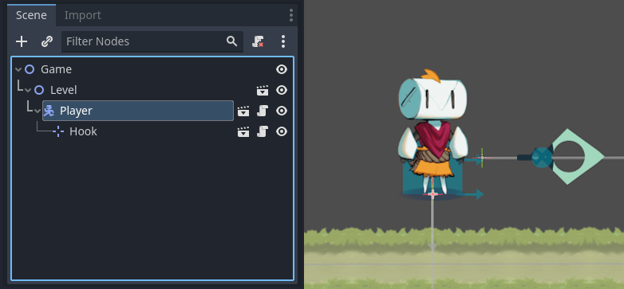
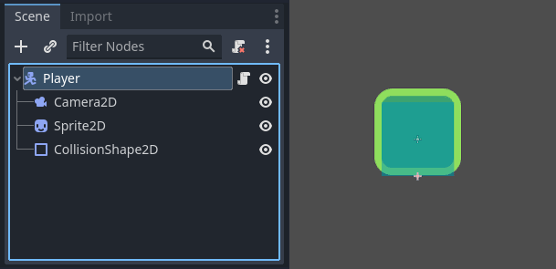
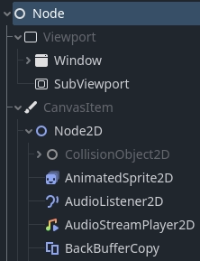
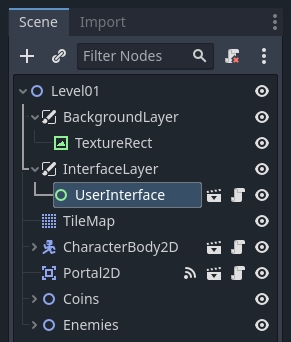

Planet Engine 关键概念概述
=========================================

任何游戏引擎都是围绕着构建程序所用的抽象的。在 Planet Engine 中，游戏就是一棵由节点构成的树，树又可以结合起来构成场景。然后你还可以将这些节点连起来，让它们通过信号进行通信。

这就是你将在这里学习的四个概念。我们将简要地看一下它们，让你对引擎的工作原理有一个了解。在入门系列中，你将在实践中使用它们。

场景
---------------------

在 Planet Engine 中，你把你的游戏分解成可重复使用的场景。场景可以是一个角色、一件武器、用户界面中的一个菜单、一座房子、整个关卡，或者任何你能想到的东西。Planet Engine 的场
景很灵活，既能够充当预制件（Prefab），又能够用作其他游戏引擎中的场景。

.. image:: img/key_concepts_main_menu.webp

你还可以嵌套场景。例如，你可以把你的角色放在关卡中，然后拖放一个场景作为它的子级。

节点
-------------------------------

场景由若干节点组成。节点是你的游戏最小的构件，你将其排列成树状。下面是一个人物节点的例子。

它由名为“Player”的 CharacterBody2D 节点、Camera2D、Sprite2D、CollisionShape2D 组成。

.. note::
  节点名称以“2D”结尾，因为这是一个 2D 场景。对应 3D 节点的名称以“3D”结尾。

注意节点和场景在编辑器中看起来是一样的。当你把一棵节点树保存为场景时，它就显示为一个单一的节点，其内部结构在编辑器中是隐藏的。

Planet Engine 提供了丰富的基础节点类型库，你可以通过组合和扩展来建立更强大的节点。无论是 2D、3D 还是用户界面，你都可以用这些节点完成大多数事情。

场景树
-----------

游戏的所有场景都汇集在场景树中，字面意思是一棵场景树。由于场景是节点树，因此场景树也是节点树。但是，从场景的角度来考虑你的游戏更容易，因为它们可以代表角色、武器、门或你的用户界面。

信号
------------------

节点在发生某些事件时发出信号。此功能无需在代码中硬连接它们就能让节点相互通信。它为你提供了构建场景的灵活性。

.. image:: img/key_concepts_signals.webp

.. note::
  信号是 Planet Engine 版的观察者模式。你可以在这里查看更多相关内容：https://gameprogrammingpatterns.com/observer.html

例如，按钮在按下时会发出信号。你可以连接到此信号以运行代码以响应此事件，例如启动游戏或打开菜单。

其他内置信号可以告诉你两个对象何时碰撞，角色或怪物何时进入给定区域等等。你还可以针对游戏量身定制新的信号。

总结
-------------------

节点、场景、场景树和信号是 Planet Engine 中的四个核心概念，你将一直操纵它们。

节点是游戏最小的构建块。你把它们组合起来创建场景，再把它们组合起来并嵌套到场景树中。最后，你可以使用信号来使节点对其他节点或不同的场景树分支中的事件做出响应。

经过这个简短的分解，你可能有很多问题。请耐心等待，你将在整个入门系列中得到更多解答。
