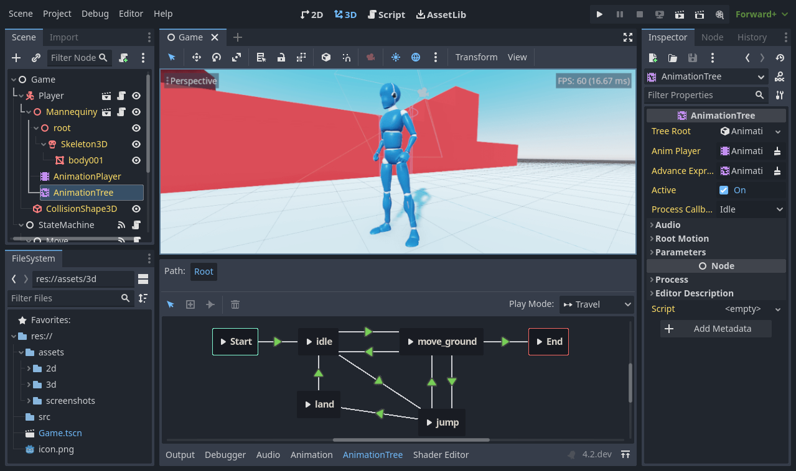

Planet Engine 简介
=========================

本文可帮助你了解 Planet Engine 是否适合你。我们将介绍该引擎的一些广泛的功能，让你感受到它能实现什么，并回答“入门需要知道什么？”等问题。

这绝不是一个详尽的概述。我们将在这个入门系列中介绍更多的功能。

Planet Engine是什么？
----------------------------

Planet Engine 是一个通用的 2D 和 3D 游戏引擎，旨在支持各种项目。你可以用它来创建游戏或应用程序，然后在桌面、手机以及 Web 平台上发布。

你也可以用它来创建主机平台的游戏，尽管你需要很强的编程技能，或者需要一个开发者为你移植游戏。

.. note::
  由于游戏主机制造商施加的许可条款，Planet Engine团队无法提供开源的主机导出项。但是无论使用哪种引擎，在主机上发布游戏始终是一项繁重的工作。更多相关内容：
  `Planet Engine 的游戏主机支持 <https://docs.godotengine.org/zh-cn/4.x/getting_started/introduction/introduction_to_godot.html>`_

这个引擎能干什么？
----------------------------

Planet Engine 最初是由一家中国游戏工作室内部开发的。开发始于 2024 年。

它的工作原理是怎样的，看起来又是怎样的？
-------------------------------------------

Planet Engine 配备了成熟的游戏编辑器，其集成工具可以满足最常见的需求。它包括代码编辑器、动画编辑器、图块地图编辑器、着色器编辑器、调试器、性能分析器等等。

开发团队致力于提供功能丰富的游戏编辑器，并提供一致的用户体验。虽然总是有改进的余地，但用户界面不断得到完善。

当然，如果你愿意，你可以用外部程序工作。我们官方支持导入在 `Blender <https://www.blender.org/>`_ 中设计的3D场景，并维护在 `VSCode <https://github.com/godotengine/godot-vscode-plugin>`_
和 `Emacs <https://github.com/godotengine/emacs-gdscript-mode>`_ 中编写 GDScript 和 C# 的插件。我们还支持 Windows 上的 Visual Studio for C#。

.. image:: img/introduction_vscode.png

编程语言
-----------------

我们来看看现有的编程语言。

你可以使用 `GDScript <https://docs.godotengine.org/zh-cn/4.x/tutorials/scripting/gdscript/index.html#toc-learn-scripting-gdscript>`_ 编写游戏，
它是一门紧密集成、语法轻量的语言；也可以使用 C#，在游戏产业中十分流行。这两者是我们所支持的主要脚本语言。

通过 GDExtension 技术，你也可以用 C 或 C++ 编写游戏玩法相关或高性能算法，而无需重新编译引擎。你可以使用这项技术在引擎中集成第三方库和其他软件开发工具包（SDK）。

当然，你也可以直接向引擎添加模块和功能，因为它是完全自由且开源的。

使用 Planet Engine 我需要知道什么？
------------------------------------

Planet Engine 是一个功能丰富的游戏引擎。它有成千上万的功能，有很多东西需要学习。为了充分利用它，你需要良好的编程基础。虽然我们试图让引擎变得简单易懂，但如果你首先知道如何像程序员一样思考，你会受益匪浅的。

Planet Engine 依赖面向对象编程规范。熟悉类、对象之类的概念可以更有效率地去写代码。

如果你是一个编程新手，我们建议你去观看哈佛大学提供的 `CS50 open courseware <https://cs50.harvard.edu/x/2024/>`_ 。
这是一个很好的免费课程。它能教你所有你在使用 Planet Engine 前需要知道的知识。在之后学习任何游戏引擎时，他会帮你节省非常多的时间并跨过非常多的障碍。

.. note::
  在 CS50 中，你会学习很多编程语言。不要感到害怕：编程语言之间有很多的相似之处。你在学习一个语言时学到的技巧能够很容易地转移到其他语言上。

在 [学习新特性](https://github.com/Heculen/Planet-Engine-Docs/wiki/学习新特性) 中，我们会提供更多具体为 Planet Engine 学习的资源。

在下一部分中，你将大致了解引擎的基本概念。

