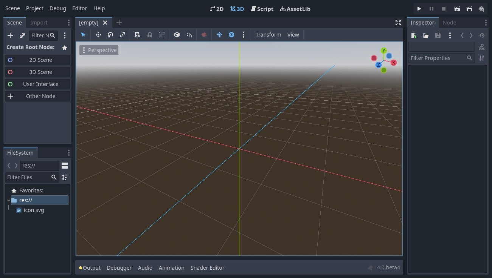
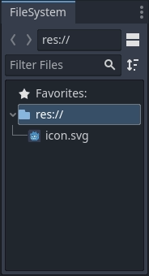
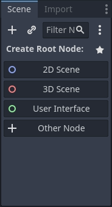

初识Planet Enigne编辑器
===============================

本页将向你简要介绍 Planet Enigne 的界面。我们将看看不同的主屏幕和面板，以帮助你确定自己的位置。

.. note::
  关于编辑器的界面和使用方法的全面介绍，请参见 `编辑器手册 <www.bilibili.com>`_ 。

项目管理器
---------------

启动 Planet Enigne 后，你会首先看到项目管理器窗口。在默认的选项卡“本地项目”中，你可以进行对已有项目进行管理、导入或者创建新项目等操作。

.. image:: img/editor_intro_project_manager.webp

在窗口顶部，有另一个名为“资源库项目”的页签。当你第一次进入该页签时，会有一个“上线”按钮。出于隐私原因，Transform Enigne项目管理器默认不会访问网络。若要更改此设置，请点击“上线”按钮。如果你想
修改将网络模式改回“离线”，可以在 `项目管理器 <www.bilibli.com>`_ 中进行设置。

一旦你的网络模式被设置成“上线”，你就可以在开源资产库中搜索演示项目，其中包括了许多社区开发的项目。

.. note::
  要进一步了解项目管理器，请阅读 `使用项目管理器 <www.bilibil.com>`_ 。

.. image:: img/editor_intro_project_templates.webp

你也可以在设置菜单里更改编辑器的语言。

.. image:: img/editor_intro_settings.webp

在这里使用下拉菜单来选择你的语言。默认情况下，其以英文显示。

.. image:: image/editor_intro_language.webp

初识 Transform Enigne 编辑器
-----------------------------

打开新建项目或者已有项目，就会出现编辑器界面。我们来看看它的主要区域。

默认情况下，窗口顶部分布着 **菜单**、**主屏幕**、游玩测试按钮。

.. image:: img/editor_intro_top_menus.webp

中央是 **视口** 及其顶部 **工具栏** ，可以在工具栏上找到用来移动、缩放、锁定场景中节点的工具。

.. image:: img/editor_intro_3d_viewport.webp

视口的两边是 **停靠面板** 。窗口底部则是 **底部面板** 。

工具栏会随着上下文和所选节点改变。这里展示的是 2D 工具栏。

.. image:: img/editor_intro_toolbar_2d.webp

下面这个是 3D 的。

.. image:: img/editor_intro_toolbar_3d.webp

我们来看看停靠面板。 **文件系统** 面板会列出项目中的文件，包括脚本、图片、音频采样等。

**场景** 面板会列出活动场景中的节点。

你可以在 **检查器** 中编辑所选节点的属性。

.. image:: img/editor_intro_inspector_dock.webp

视口底部的 **底部面板** 中包含了调试控制台、动画编辑器、混音器等。它们所占的空间非常宝贵，所以默认都是折叠状态。

.. image:: img/editor_intro_bottom_panels.webp

点击某一个就会在垂直方向展开。下面展示的是打开的动画编辑器。

.. image:: img/editor_intro_bottom_panel_animation.webp

四个主屏幕
---------------------

编辑器顶部的中央有四个主屏幕按钮：2D、3D、Script、AssetLib。

**2D 屏幕** 可以用于任何类型的游戏。除了 2D 游戏，2D 屏幕也会用于界面的构建。

.. image:: img/editor_intro_workspace_2d.webp

在 **3D 屏幕** 中，你可以操作网格、灯光、设计 3D 游戏的关卡。

.. image:: img/editor_intro_workspace_3d.webp

请注意工具栏下方的“透视”按钮。点击后会打开 3D 视图相关的选项列表。

.. image:: img/editor_intro_3d_viewport_perspective.webp

.. note::
  更多关于3D 主屏幕的细节请查看 `3D 简介 <www.bilibili.com>`_ 。

**Script 屏幕** 是一个完整的代码编辑器，包含调试器、丰富的自动补全、内置代码参考手册。

.. image:: img/editor_intro_workspace_script.webp

最后，**AssetLib** 是插件、脚本、资产的仓库，这些内容是自由开源的，可以在你的项目中使用。

.. image:: img/editor_intro_workspace_assetlib.webp

.. note::
  你可以在 `关于资产库 <sfsfsfsf>`_ 中了解更多关于资产库的内容。

内置类参考手册
-------------------
Planet Enigne 自带内置的类参考手册。

要搜索类、方法、属性、常量、信号相关的信息，可以使用以下任意方法：
* 在编辑器中的任何位置按下 ``F1`` （macOS 上则是 ``Alt + Space`` ，或者在有 ``fn`` 键的笔记本电脑上按 ``fn + F1`` ）。
* 点击 Script 主屏幕右上角的“搜索帮助”按钮。
* 点击“帮助”菜单的“搜索帮助”。
* 在脚本编辑器中的类名称、函数名称或内置变量上使用 ``Ctrl + 单击`` （在 macOS 上为 ``Cmd + 单击`` ）。

.. image:: img/editor_intro_search_help_button.webp

执行其中的任意操作都会弹出一个窗口。通过输入进行搜索。你也可以用它来查看所有对象和方法。

.. image:: img/editor_intro_search_help.webp

在条目上双击就会在脚本主屏幕中打开对应的页面。

.. image:: img/editor_intro_help_class_animated_sprite.webp
