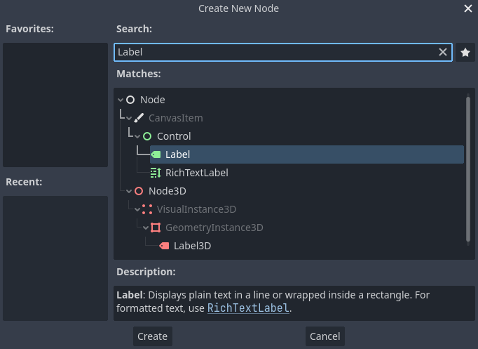

节点与场景
===============

在 :ref:`Planet Engine 关键概念概述 <Planet_Engine_gjgngs>` 中，我们看到 Planet Engine 游戏就是由场景构成的树状结构，而每一个场景又是一个由节点构成的树状结构。在这一节中，我们将更详细地解释这些概念，你还将创建你的第一个场景。

节点
-----

**节点是你的游戏的基本构件** 。它们就像食谱里的食材。Godot 引擎包含很多种节点，可以用来显示图像、播放声音、表示摄像机等等。

.. image:: img/nodes_and_scenes_nodes.webp

所有节点都具备以下特性：

- 名称。
- 可编辑的属性。
- 每帧都可以接收回调以进行更新。
- 你可以使用新的属性和函数来进行扩展。
- 你可以将它们添加为其他节点的子节点。

最后一个特征很重要。 **节点会组成一棵树** ，这个功能组织起项目来非常强大。因为不同的节点有不同的功能，将它们组合起来可以产生更复杂的行为。 正如我们之前看到的，你可以用一个 :ref:`CharacterBody2D <class_CharacterBody2D>` 节点、一个 :ref:`Sprite2D <class_Sprite2D>` 节点、一个 :ref:`Camera2D <class_Camera2D>` 节点以及一个 :ref:`CollisionShape2D <class_CollisionShape2D>` 节点来建立一个摄像机跟随的可玩角色。

.. image:: img/nodes_and_scenes_character_nodes.webp

场景
-----------

当你在树中组织节点时，就像我们的角色一样，我们称之为场景构造。保存后，场景的工作方式类似
于编辑器中的新节点类型，你可以在其中将它们添加为现有节点的子节点。在这种情况下，场景实例显示为隐藏其内部结构的单个节点。

场景允许你以你想要的方式来构造你的游戏代码。你可以 **组合节点** 来创建自定义和复杂的节点类型，比如能跑能跳的游戏角色、生命条、可以互动的箱子等等。

本质上，Godot 编辑器就是一个 **场景编辑器** 。它有很多用于编辑 2D 和 3D 场景以及用户界面的工具。Godot 项目中可以包含任意数量你所需要的场景。引擎只要求将其中之一设为程序的主场景。这是你或者玩家运行游戏时，Godot 最初加载的场景。

除了像节点一样工作之外，场景还具有以下特点：

1.它们始终有一个根节点，就像我们示例中的“Player”一样。

2.你可以把它们保存到你的硬盘上，以后再加载。

3.你可以根据需要创建任意数量的场景实例。你的游戏中可以有五个或十个角色，这些角色是从角色场景中创建的。

创建第一个场景
----------------

让我们只用一个节点来创建我们的第一个场景吧。首先你需要 :ref:`创建第一个项目 <doc_creating_and_importing_projects>` 。在打开项目后，你看到的应该是一个空的编辑器。

.. image:: img/nodes_and_scenes_01_empty_editor.webp

在空场景中，左侧的“场景”停靠面板提供了几个快速添加根节点的选项。“2D 场景”会添加 :ref:`Node2D <class_Node2D>` 节点，“3D 场景”会添加 :ref:`Node3D <class_Node3D>` 节点，“用户界面”会添加 :ref:`Control <class_Control>` 节点。这些预设是为了提供方便；不是强制选择的。“其他节点”可以选择任何节点作为根节点。在空场景中，“其他节点”等价于点击“场景”停靠面板左上角的“添加子节点”按钮，这个按钮的作用通常是为当前选中的节点添加一个新的子节点。

我们要往场景中添加一个 :ref:`Label <class_Label>` 节点。它的功能是在屏幕上绘制文字。

点击“添加子节点”按钮或者“其他节点”，创建根节点。

.. image:: img/nodes_and_scenes_02_scene_dock.webp

“新建 Node”对话框打开，展示一大串可用节点。

.. image:: img/nodes_and_scenes_03_create_node_window.webp

选择 Label 节点。你可以输入这个名字来对列表进行过滤。

点击 Label 节点将其选中，然后点击窗口底部的“创建”按钮。

.. image:: img/nodes_and_scenes_05_editor_with_label.webp

添加场景中的第一个节点时会发生很多事。场景会切换到 2D 工作区，因为 Label 是 2D 节点类型。该 Label 会以选中的状态出现在视口的左上角。这个节点也会出现在左侧的“场景”面板中，它的属性会书现在右侧的“检查器”面板里。

修改节点的属性
--------------

下一步是修改 Label 的“Text”属性。我们把它改成“Hello World”。

前往视口右侧的“检查器”面板。点击 Text 属性下方的字段，然后填入“Hello World”。

.. image:: img/nodes_and_scenes_06_label_text.webp

在你打字的同时，你会发现视口中也绘制出了这段文字。

选择工具栏上的移动工具，就可以在视口中移动你的 Label 节点。

.. image:: img/nodes_and_scenes_07_move_tool.webp

选中 Label，点击并拖拽视口中的任何位置，将它移动到矩形框所表示的视图中心。

.. image:: img/nodes_and_scenes_08_hello_world_text.webp

运行场景
---------

运行场景一切就绪！请按下屏幕右上角的“运行场景”按钮或 ``F6`` （ ``macOS`` 上则是 ``Cmd + R`` ）。

.. image:: img/nodes_and_scenes_09_play_scene_button.webp

A popup invites you to save the scene, which is required to run it.
Click the Save button in the file browser to save it as ``label.tscn``.

.. note:: The Save Scene As dialog, like other file dialogs in the editor, only
          allows you to save files inside the project. The ``res://`` path at
          the top of the window represents the project's root directory and
          stands for "resource path". For more information about file paths in
          Godot, see :ref:`doc_filesystem`.

The application should open in a new window and display the text "Hello World".

.. image:: img/nodes_and_scenes_11_final_result.webp

Close the window or press :kbd:`F8` (:kbd:`Cmd + .` on macOS) to quit the running scene.

Setting the main scene
----------------------

To run our test scene, we used the Run Current Scene button. Another button next to it
allows you to set and run the project's main scene. You can press :kbd:`F5`
(:kbd:`Cmd + B` on macOS) to do so.

A popup window appears and invites you to select the main scene.

Click the Select button, and in the file dialog that appears, double click on
``label.tscn``.

The demo should run again. Moving forward, every time you run the project, Godot
will use this scene as a starting point.

.. note:: The editor saves the main scene's path in a project.godot file in your
          project's directory. While you can edit this text file directly to
          change project settings, you can also use the "Project -> Project
          Settings" window to do so. For more information, see
          :ref:`doc_project_settings`.

In the next part, we will discuss another key concept in games and in Godot:
creating instances of a scene.
